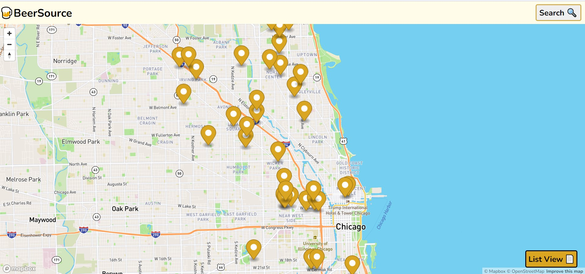

# About BeerSource!

## Website

Check out the website in action:

https://a-stepanian.github.io/brewery-finder/

## Screenshots

### Mobile-first design

### Responsive for all screen sizes

### Loading and error states

## Random Notes to clean up later

-take form input and split at space and join with underscore to fetch api data for multiple word cities.

-make state input field because there are multiple states with the same city name.

-find array of state names online and use it to map the options for the state select in the form.

-mapbox is a bit different with react, had to spend a few hours combing through docs to use it. Also learned that environmental varibles are handled differently in react.

-getting error in console from not including a key in the option tags in the find component. Added index for the mapping. This was because of iterating over an array.

-api returns 20 breweries at a time, so needed to dynamically fetch additional data if it exists.

-console.log not working in any of the components.

-drop down menu doesn't work with map feature, had to make map z-index -1.

struggled with the map positioning on mobile browsers.
